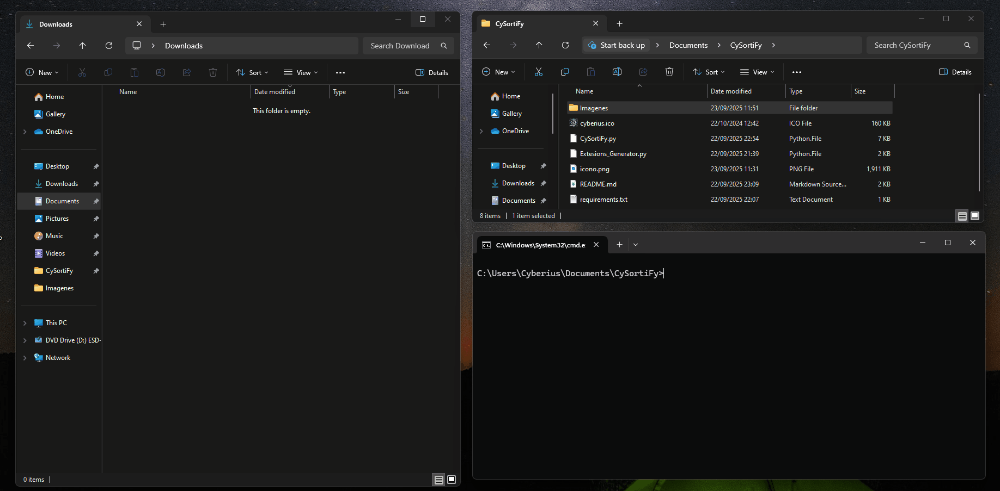

<p align="center">
  <a href="https://github.com/cyberiuscompany/CySortiFy">
    
    <strong>Español</strong>
  </a>
  &nbsp;|&nbsp;
  
  <strong>English</strong>
  &nbsp;|&nbsp;
  <a href="https://www.youtube.com/watch?v=xvFZjo5PgG0&list=RDxvFZjo5PgG0&start_radio=1&pp=ygUTcmljayByb2xsaW5nIG5vIGFkc6AHAQ%3D%3D">
    
    <strong>日本語</strong>
  </a>
</p>

# CySortiFy
CySortify is a lightweight **Python** tool that automatically organizes your **Downloads** folder on Windows, classifying files into **logical categories** (Docs, Pics, Movies, Setups, etc.) or by **extension** if they don't match any defined category.  

---

## 📝 Usage

- It starts with an icon in the tray (blue circle).  
- Every **30 seconds** it scans the **Downloads** folder and organizes files.  
- If it finds an unregistered extension, it moves it to its own `.ext` folder.  
- From the tray menu you can:
  - **Organize now**
  - **Open Downloads**
  - **Exit**

---

<p align="center">
  
</p

--- 

## 🎥 Demo

<p align="center">
  
</p>

---

## Tool screenshots

<h2 align="center">Before and After Example</h2>
<div align="center">
  
  
</div>

<h2 align="center">Generating Random Files</h2>
<p align="center">
  
</p>

<h2 align="center">Tool Running in Background</h2>
<p align="center">
  
</p>

<h2 align="center">Background Process</h2>
<p align="center">
  
</p>

<h2 align="center">Background Process Options</h2>
<p align="center">
  
</p>

## 🚀 Features

- ✔️ Automatic organization of files into folders by type.  
- ✔️ Very comprehensive predefined categories (Docs, Pics, Movies, Setups, Archives, Code, CAD, etc.).  
- ✔️ Unrecognized files are moved into a folder named by their extension (`.xyz`).  
- ✔️ New extensions are recorded in memory (`Unsorted`) without creating external files.  
- ✔️ Runs in the background with a tray icon.  
- ✔️ Windows notifications when a file is moved.  
- ✔️ Zero external configuration dependencies (`categories.json` is embedded in the code).  
- ✔️ Produces a **portable .exe** (no external JSON required).  


## 📑 Included categories

The program includes a very wide catalog of extensions, such as:

- **Docs** → `.pdf`, `.docx`, `.pptx`, `.xls`, `.txt`, `.epub`, `.mobi`, `.djvu`, `.odt`…  
- **Pics** → `.jpg`, `.png`, `.gif`, `.tiff`, `.heic`, `.raw`, `.cr2`, `.nef`, `.dng`…  
- **Audio** → `.mp3`, `.wav`, `.flac`, `.aac`, `.ogg`, `.m4a`, `.mid`, `.opus`…  
- **Movies** → `.mp4`, `.avi`, `.mkv`, `.mov`, `.wmv`, `.flv`, `.webm`, `.ts`…  
- **Setups** → `.exe`, `.msi`, `.iso`, `.apk`, `.deb`, `.rpm`, `.pkg`…  
- **Archives** → `.zip`, `.rar`, `.7z`, `.tar`, `.gz`, `.xz`, `.cab`, `.tgz`…  
- **Code** → `.py`, `.sh`, `.bat`, `.ps1`, `.js`, `.html`, `.css`, `.sql`, `.cpp`, `.java`, `.go`, `.rs`, `.kt`, `.asm`…  
- **CAD/3D** → `.dwg`, `.dxf`, `.stl`, `.step`, `.fbx`, `.blend`, `.c4d`…  
- **Games** → `.iso`, `.nrg`, `.nds`, `.3ds`, `.gba`, `.smc`, `.nes`, `.sav`…  
- **Security** → `.pem`, `.crt`, `.cer`, `.pfx`, `.csr`, `.asc`, `.gpg`, `.jks`…  
- **Fonts** → `.ttf`, `.otf`, `.woff`, `.fon`…  
- **Backups** → `.bak`, `.old`, `.vhd`, `.vmdk`, `.gho`…  
- **Others** → `.log`, `.dat`, `.tmp`, `.url`, `.sys`…  

---

## 🧪 Test files generator

Use `Extesions_Generator.py` to quickly generate 50 test files in your Downloads folder with random extensions to validate behavior:

```bash
python Extesions_Generator.py
```

---

## 📁 Project structure

```bash
CYSORTIFY/
├── CySortify.py # main organizer (tray + notifications)
├── Extesions_Generator.py # test files generator with random extensions
├── README.md # this file (Spanish)
└── requirements.txt # Python dependencies
```
---

## 📄 Additional documentation

- [🤝 Code of Conduct](.github/CODE_OF_CONDUCT.md)
- [📬 How to Contribute](.github/CONTRIBUTING.md)
- [🔐 Security](.github/SECURITY.md)
- [⚠️ Legal Disclaimer](DISCLAIMER.md)
- [📜 License](LICENSE)
- [📢 Support](.github/SUPPORT.md)

---

## ⚙️ 1.1 Basic usage with clone 🪟 Windows

```bash
git clone https://github.com/cyberiuscompany/CySortiFy.git
cd CySortiFy
python -m venv venv (Not mandatory)
.\venv\Scripts\activate (Not mandatory)
pip install -r requirements.txt
python CySortiFy.py
```

## ⚙️ 1.1 Build heavy .exe 🪟 Windows

```bash
# Create the heavy binary .exe with everything included
git clone https://github.com/cyberiuscompany/CySortiFy.git
cd CySortiFy
python -m venv venv (Not mandatory)
.\venv\Scripts\activate (Not mandatory)
pip install pyinstaller
pyinstaller --clean --onefile --noconsole --version-file=version.txt --icon=cyberius.ico CySortify.py

# Run the program executable
CySortiFy/
├── dist/
│   └── CySortiFy/
│       └── CySortiFy.exe  ← THIS IS THE EXECUTABLE

⚠️ **Attention!**
You can move this binary anywhere because the .exe contains everything it needs to run,
but it will take longer to start because it loads more functions, libraries and DLLs.
