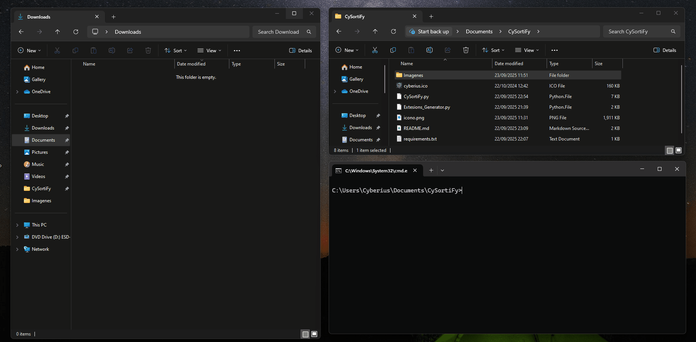

<p align="center">
  
  <strong>Español</strong>
  &nbsp;|&nbsp;
  <a href="README.en.md">
    
    <strong>English</strong>
  </a>
  &nbsp;|&nbsp;
  <a href="https://www.youtube.com/watch?v=xvFZjo5PgG0&list=RDxvFZjo5PgG0&start_radio=1&pp=ygUTcmljayByb2xsaW5nIG5vIGFkc6AHAQ%3D%3D">
    
    <strong>日本語</strong>
  </a>
</p>

# CySortiFy
CySortify es una herramienta ligera en **Python** que organiza automáticamente tu carpeta de **Descargas** en Windows, la cual clasifica los archivos por **categorías lógicas** (Docs, Pics, Movies, Setups, etc.) o por **extensión** si no encajan en ninguna categoría definida.  

---

## 📝 Uso

- Se inicia con un icono en la bandeja (círculo azul).  
- Cada **30 segundos** analiza la carpeta de **Descargas** y organiza archivos.  
- Si encuentra una extensión no registrada, la mueve a una carpeta propia `.ext`.  
- Desde el menú de la bandeja puedes:
  - **Organizar ahora**
  - **Abrir Descargas**
  - **Salir**

---

<p align="center">
  
</p

---

## 🎥 Demostración

<p align="center">
  
</p>

---

## Fotos de Herramienta

<h2 align="center">Ejemplo del Antes y el Después</h2>
<div align="center">
  
  
</div>

<h2 align="center">Generando Ficheros Aleatorios</h2>
<p align="center">
  
</p>

<h2 align="center">Herrramienta Ejecutada y Ejecudad en Segundo Plano</h2>
<p align="center">
  
</p>

<h2 align="center">Proceso en Segundo Plano</h2>
<p align="center">
  
</p>

<h2 align="center">Opciones  Proceso Segundo Plano</h2>
<p align="center">
  
</p>

## 🚀 Características

- ✔️ Organización automática de archivos en carpetas según tipo.  
- ✔️ Categorías predefinidas muy completas (Docs, Pics, Movies, Setups, Archives, Code, CAD, etc.).  
- ✔️ Archivos no reconocidos se mueven a una carpeta por extensión (`.xyz`).  
- ✔️ Extensiones nuevas se registran en memoria (`Unsorted`) sin generar ficheros externos.  
- ✔️ Ejecución en segundo plano con icono en bandeja.  
- ✔️ Notificaciones en Windows cada vez que un archivo es movido.  
- ✔️ Cero dependencias externas de configuración (`categories.json` está embebido en el código).  
- ✔️ Generación de **.exe portable** (sin JSON adicional). 


## 📑 Categorías incluidas

El programa incluye un catálogo muy amplio de extensiones, entre ellas:

- **Docs** → `.pdf`, `.docx`, `.pptx`, `.xls`, `.txt`, `.epub`, `.mobi`, `.djvu`, `.odt`…  
- **Pics** → `.jpg`, `.png`, `.gif`, `.tiff`, `.heic`, `.raw`, `.cr2`, `.nef`, `.dng`…  
- **Audio** → `.mp3`, `.wav`, `.flac`, `.aac`, `.ogg`, `.m4a`, `.mid`, `.opus`…  
- **Movies** → `.mp4`, `.avi`, `.mkv`, `.mov`, `.wmv`, `.flv`, `.webm`, `.ts`…  
- **Setups** → `.exe`, `.msi`, `.iso`, `.apk`, `.deb`, `.rpm`, `.pkg`…  
- **Archives** → `.zip`, `.rar`, `.7z`, `.tar`, `.gz`, `.xz`, `.cab`, `.tgz`…  
- **Code** → `.py`, `.sh`, `.bat`, `.ps1`, `.js`, `.html`, `.css`, `.sql`, `.cpp`, `.java`, `.go`, `.rs`, `.kt`, `.asm`…  
- **CAD/3D** → `.dwg`, `.dxf`, `.stl`, `.step`, `.fbx`, `.blend`, `.c4d`…  
- **Games** → `.iso`, `.nrg`, `.nds`, `.3ds`, `.gba`, `.smc`, `.nes`, `.sav`…  
- **Security** → `.pem`, `.crt`, `.cer`, `.pfx`, `.csr`, `.asc`, `.gpg`, `.jks`…  
- **Fonts** → `.ttf`, `.otf`, `.woff`, `.fon`…  
- **Backups** → `.bak`, `.old`, `.vhd`, `.vmdk`, `.gho`…  
- **Otros** → `.log`, `.dat`, `.tmp`, `.url`, `.sys`…  

---

## 🧪 Generador de pruebas

Con `Extesions_Generator.py` puedes generar rápidamente 50 ficheros de prueba en tu carpeta de Descargas con extensiones aleatorias para comprobar el funcionamiento:

```bash
python Extesions_Generator.py
```

---

## 📁 Estructura del proyecto

```bash
CYSORTIFY/
├── CySortify.py # organizador principal (bandeja + notificaciones)
├── Extesions_Generator.py # generador de ficheros de prueba con extensiones aleatorias
├── README.md # este archivo
└── requirements.txt # dependencias Python
```
---

## 📄 Documentación adicional

- [🤝 Código de Conducta](.github/CODE_OF_CONDUCT.md)
- [📬 Cómo contribuir](.github/CONTRIBUTING.md)
- [🔐 Seguridad](.github/SECURITY.md)
- [⚠️Aviso legal](DISCLAIMER.md)
- [📜 Licencia](LICENSE)
- [📢 Soporte](.github/SUPPORT.md)

---

## ⚙️ 1.1 Uso básica con clonado 🪟 Windows

```bash
git clone https://github.com/cyberiuscompany/CySortiFy.git
cd CySortiFy
python -m venv venv (No es obligatorio este comando)
.\venv\Scripts\activate (No es obligatorio este comando)
pip install -r requirements.txt
python CySortiFy.py
```

## ⚙️ 1.1 Generar Compilado Pesado .exe 🪟 Windows

```bash
# Crear el .exe del programa siendo versión binario pesado, con todo incluido
git clone https://github.com/cyberiuscompany/CySortiFy.git
cd CySortiFy
python -m venv venv (No es obligatorio este comando)
.\venv\Scripts\activate (No es obligatorio este comando)
pip install pyinstaller
pyinstaller --clean --onefile --noconsole --version-file=version.txt --icon=cyberius.ico CySortify.py

# Ejecutar el .exe del programa
CySortiFy/
├── dist/
│   └── CySortiFy/
│       └── CySortiFy.exe  ← ESTE ES EL EJECUTABLE

⚠️ **¡Atención!**
Este binario lo puedes mover de lugar, dado que dentro el .exe contiene todo lo necesario para funcionar
pero tardara mas en abrirse, al ocupar mas tamaño y cargar mas funciones, librerías y DLLs.
```
